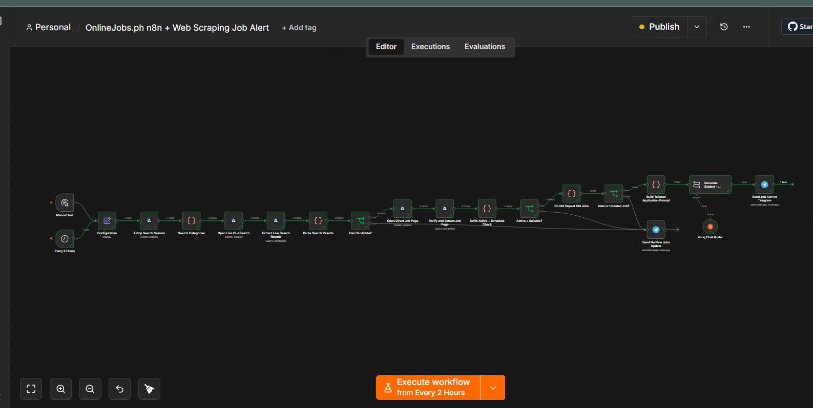
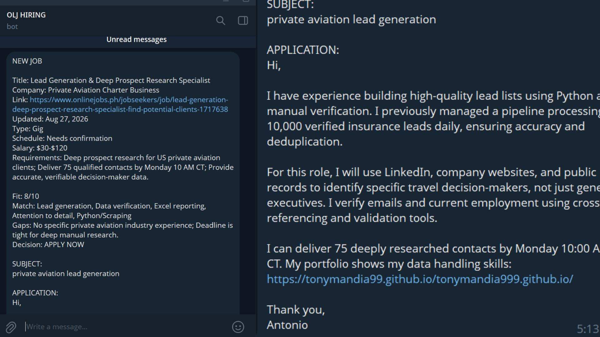

# OnlineJobs.ph n8n and Web Scraping Job Alert

An n8n workflow that searches OnlineJobs.ph for recent **n8n automation** and **web-scraping** opportunities, verifies each direct job page, filters unsuitable listings, and sends a concise job assessment with a customized application draft to Telegram.



## Problem

Finding suitable jobs manually takes time. Search results may be duplicated, outdated, expired, or incompatible with the applicant's available hours. Writing a customized application for every listing adds more repetitive work.

## Solution

This workflow performs the research and drafting steps while keeping the final application under human control.

```text
6-hour schedule / manual test
→ Open live OnlineJobs.ph searches with Airtop
→ Extract and deduplicate direct job links
→ Open and verify each current job page
→ Check freshness, active status, application route, and schedule
→ Block previously reported jobs
→ Generate a short fit assessment and application draft with Groq
→ Send the result to Telegram
```

The workflow never submits a job application.

## Key Features

- Searches only for n8n automation and web-scraping roles
- Reads the current OnlineJobs.ph search results and direct job pages
- Rejects expired, closed, removed, uncertain, and external-form-only listings
- Prioritizes jobs posted or updated within the last seven days
- Excludes confirmed shifts outside 4:00 PM–12:00 AM Philippine time
- Removes duplicate links found under multiple search categories
- Remembers previously reported jobs during active scheduled executions
- Produces a fit score, matching skills, honest gaps, subject, and short application
- Uses a six-hour schedule and a maximum of three results per category to reduce free-tier errors
- Excludes AI-video, video-editing, YouTube-automation, and faceless-video jobs
## Telegram Output

The workflow sends the verified job details, fit assessment, application subject, and customized application draft directly to Telegram.


## Tools Used

- n8n
- Airtop
- Groq Chat Model (`qwen/qwen3.8-27b`, temperature `0.2`)
- Telegram Bot
- JavaScript Code nodes
- OnlineJobs.ph

## Setup

1. Download or clone this repository.
2. Import [workflow.json](workflow.json) into n8n.
3. Connect an Airtop API credential to every Airtop node.
4. Connect a Groq API credential to the **Groq Chat Model** node.
5. Connect a Telegram credential to both Telegram nodes.
6. Open the **Configuration** node and replace `REPLACE_WITH_YOUR_TELEGRAM_CHAT_ID`.
7. Run **Manual Test** once and inspect the output.
8. Save and activate the workflow for scheduled executions.

Set the workflow timezone to `Asia/Manila`. Airtop sessions use their configured idle timeout, so avoid starting several manual tests at the same time.

## Configuration

The included workflow uses these conservative defaults:

```text
Schedule: Every 6 hours
Maximum results per category: 3
Categories: n8n automation, web scraping
Job age: Up to 7 days
Candidate availability: 4:00 PM–12:00 AM Philippine time
Groq temperature: 0.2
```

## Duplicate Behavior

The workflow uses n8n workflow static data to remember reported job URLs for 90 days. This history is saved during successful active production executions. Manual test executions may show the same job again.

## Security

No API keys, Telegram bot tokens, or live credential IDs are included. Add credentials inside your own n8n instance and never commit exported credentials or secret values to GitHub.

## What This Project Demonstrates

- Browser-based workflow automation
- Live-page extraction and verification
- Data normalization and deduplication
- Rule-based job filtering
- AI-assisted job-fit analysis
- Prompt design with anti-fabrication rules
- Telegram integration
- Error-aware free-tier configuration

## Repository Files

```text
.
├── assets/
│   └── Workflow-onlinejobph.png
├── snippets/
│   └── build-tailored-application-prompt.js
├── workflow.json
├── .gitignore
├── LICENSE
└── README.md
```

## Author

Antonio Mandia Jr.  
[Portfolio](https://tonymandia99.github.io/tonymandia999.github.io/)
